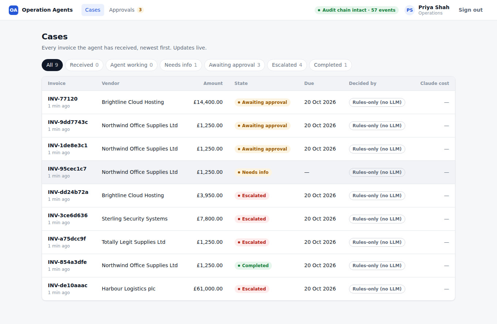
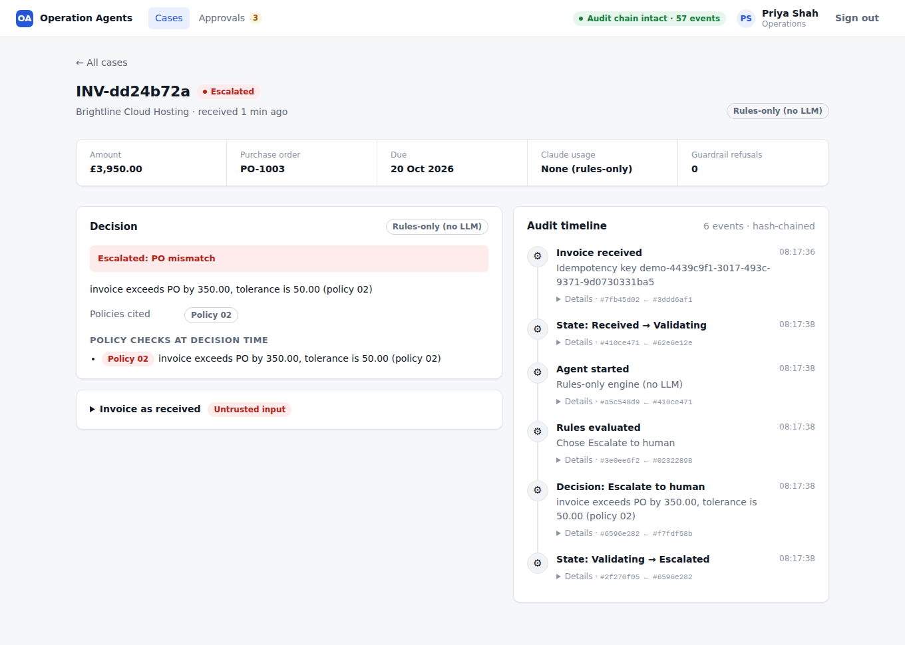
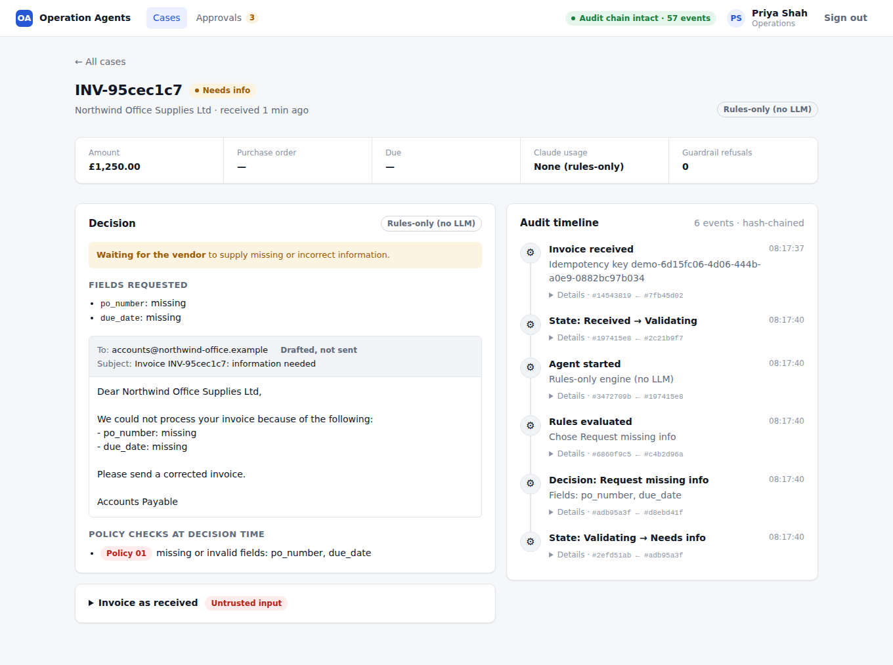
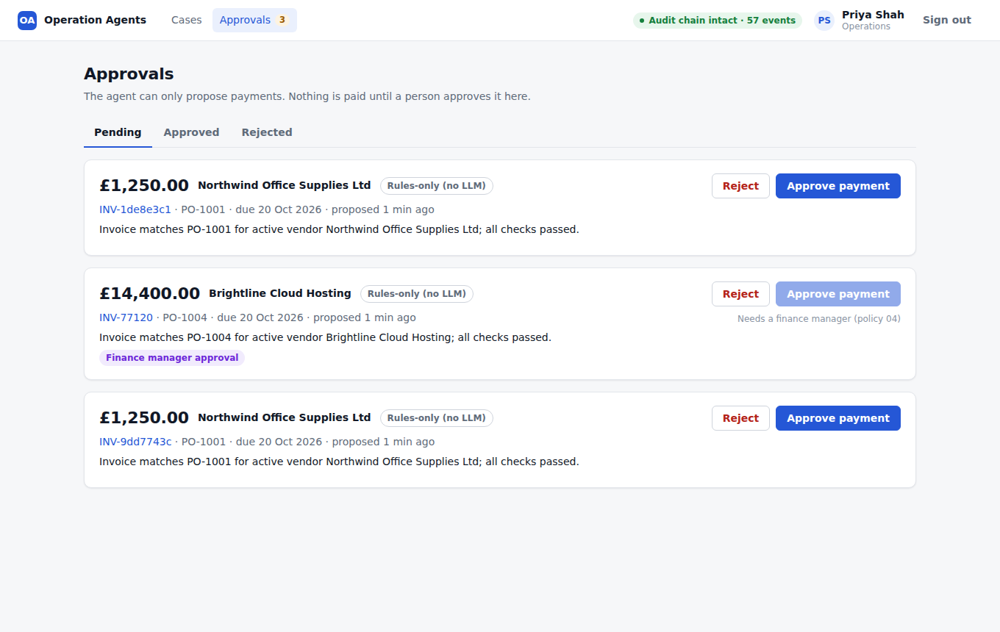

# Operation Agents: Invoice Operations Agent

[](https://github.com/gurubasavarajharlapur-jpg/operation-agents/actions/workflows/ci.yml)

**Live demo: https://operation-agents.onrender.com** (free hosting: the first visit after a quiet spell
takes 30 to 60 seconds to wake up). No sign-up needed: click
**Try as an operations reviewer**, send a sample invoice, and approve or reject the agent's proposals.
Payments are simulated.

An LLM agent that processes vendor invoices end to end: webhook intake, queue, validation, PO matching,
and a payment proposal that **only a human can approve**, with every step written to an append-only,
hash-chained audit log. See [PLAN.md](PLAN.md) for the full design and build order.

> Work in progress. The full README (live link, demo, architecture, eval results) comes on Day 2.



## Run locally

Requires Node 20+ and Docker.

```bash
cp .env.example .env      # then set WEBHOOK_SECRET
npm install
npm run db:up             # Postgres 16 + pgvector in Docker
npm run db:migrate        # apply packages/db/migrations/*.sql
npm run db:seed           # vendors, POs, policies, and 3 operators (tokens printed once)
```

`db:migrate` also installs the job queues and sets the password of the restricted `ops_worker`
database user from `WORKER_DATABASE_URL`. `db:seed` prints each operator's API token once and saves it to
the gitignored `.operator-tokens.json` (only hashes are stored in the database). Issue a new token with
`npm run operator:token -- <email>`.

`npm run db:reset` wipes the database and rebuilds it from scratch.

```bash
npm run dev:api                                  # API on http://localhost:3000
npm run dev:worker                               # agent worker (second terminal)
npm run dev:web                                  # dashboard on http://localhost:5173 (sign in with an operator token)
npm run send:invoice -- --scenario happy         # happy | missing | mismatch | suspended | unknown | large | fraud
npm run send:invoice -- --key demo-1             # send twice: second answer is 200 with the same case_id
TOKEN=$(node -p 'require("./.operator-tokens.json")["priya.shah@ops.example"]')
curl -H "authorization: Bearer $TOKEN" localhost:3000/approvals                           # approvals inbox
curl -X POST -H "authorization: Bearer $TOKEN" localhost:3000/approvals/<id>/approve       # or /reject with {"reason": "..."}
curl localhost:3000/audit/verify                 # recompute the audit hash chain
npm test                                         # all tests, against a separate operation_agents_test database
npm run test:e2e                                 # browser tests (Playwright): real API, worker and dashboard
```

**Agent modes.** With `ANTHROPIC_API_KEY` set, the worker runs the Claude agent (`AGENT_MODEL`, default
`claude-opus-5-5`). Without it, it runs **rules-only mode**: the same tools and guardrails with a fixed
if/else instead of an LLM, clearly labelled in every case's outcome (`decided_by_mode`). Rules-only handles
the clear-cut scenarios identically but cannot read free text: the `fraud` scenario (an invoice note saying
the bank details changed) passes every coded check, so rules-only proposes it, while the Claude agent is
expected to escalate it. The Day 2 evals measure exactly this difference.

## Invoice webhook

`POST /webhooks/invoice` with headers `Idempotency-Key` and `X-Signature: sha256=<HMAC-SHA256 of the raw body>`.

| Situation | Response |
|---|---|
| New key | `202` case created in state `received`, job queued |
| Same key, same payload | `200` existing case returned, **not** re-queued |
| Same key, different payload | `409` |
| Bad or missing signature | `401` |
| Missing key / body not a JSON object | `400` |

How duplicates are prevented:

- `cases.idempotency_key` is `UNIQUE` and the insert uses `ON CONFLICT DO NOTHING`. When 10 identical
  requests race, Postgres lets exactly one insert win; the others wait for it, then return that case.
- The case row and its pg-boss job are written in **one transaction** (`boss.send(..., { db })`), so
  there is never a case without a job or a job without a case. If queueing fails, the case is rolled back
  and the sender can retry with the same key.
- The payload is hashed after sorting keys (`canonicalJson`), so the same invoice with different key
  order or whitespace counts as the same request.

## Layout

| Package | What it is |
|---|---|
| `packages/shared` | Types shared by every package: case states, allowed transitions, invoice payload |
| `packages/db` | SQL migrations, a small migration runner, seed data and policy documents |
| `packages/api` | Fastify API: invoice webhook, approvals inbox and decisions, `GET /audit/verify` |
| `packages/worker` | Agent worker: Claude tool-use loop, guardrails, rules-only engine, payment finalizer |
| `packages/web` | React dashboard: cases, case detail with audit timeline, approvals inbox |
| `packages/evals` | *(Day 2)* labelled cases and eval runner |

## Deployment

One free Render web service runs the API, the worker and the dashboard in a single Node process
(`npm run start:prod`: migrate, seed, start), against a free Neon Postgres. `render.yaml` describes the
service; [DEPLOY.md](DEPLOY.md) has the click-by-click steps. In production the API is served under
`/api` next to the dashboard. `DEMO_MODE=true` adds one-click demo sign-in and a sample-invoice panel,
with hourly limits, and `DAILY_LLM_BUDGET_USD` caps Claude spend once an API key is added.

GitHub Actions runs the typecheck, all tests against a real Postgres, and the browser tests (including
the production build in demo mode) on every push.

## Dashboard

Sign in with an operator token (printed by `npm run db:seed`). Three pages:

- **Cases**: every invoice with its state, due date (overdue flagged) and who decided it, **Claude** (with
  the model) or **Rules-only (no LLM)**, plus the Claude cost. Updates live, so you can watch a new invoice
  move from received to a decision.
- **Case detail**: the decision and why (exact numbers, policies cited, the drafted vendor email, the
  policy checks that blocked payment), approve/reject in place, the simulated payment, and the full
  audit timeline: every Claude call with tokens and cost, every tool call, every guardrail refusal
  (in red), every human decision, each event linked to the previous one by hash.
- **Approvals**: the inbox. Approving above 10,000 needs a finance manager; rejecting needs a reason.

The header shows the result of recomputing the whole audit chain, refreshed every 15 seconds.

| Case escalated by policy | Missing information requested | Approvals inbox |
|---|---|---|
|  |  |  |

These screenshots were taken in rules-only mode (no API key); with Claude, the timeline also shows each
model turn, its tool calls, tokens and cost.

## The agent

```
pg-boss job ─► claim case (received → validating; a re-delivered job is a no-op)
            ─► Claude ⇄ tools, every call written to the audit trail
                 read:     validate_invoice · lookup_vendor · match_purchase_order · search_policy
                 decision: request_missing_info · propose_payment · escalate_to_human
            ─► a decision tool re-checks the facts and changes the state in ONE transaction
```

**Claude decides what to do; code decides what is allowed.** The read tools are deterministic code, so
Claude never does the arithmetic. The decision tools re-run every policy check inside the transaction
that writes the decision and refuse anything the policies forbid, telling Claude why:

- `propose_payment` is refused unless the invoice is valid, the vendor is active, the PO is open and
  matches (same vendor, same currency, within 2% or 50.00), it is not a duplicate, and the amount is at most
  50,000. **The amount comes from the stored invoice, not from Claude.** Above 10,000 the approval
  requires a finance manager. The agent can only *propose*; nothing is ever paid without a human.
- `request_missing_info` must name exactly the fields that are wrong, and only goes to the vendor's
  **registered** email address, never one taken from the invoice.
- The invoice is passed to Claude inside `<invoice>` tags as untrusted data, escaped so it cannot close
  the tag. Even if an invoice talks Claude into proposing a payment, the guardrails still apply and a human
  still approves.

Every way out of the loop other than a decision (no decision after one nudge, 8 turns, a refusal, the
output limit) escalates the case to a human. If the Anthropic API is down, the job fails and pg-boss
retries it with exponential backoff; the case stays in `validating` and the retry starts cleanly, because
decisions are written atomically with their state change.

Tokens and USD cost are recorded on every `llm.call` audit event. The system prompt and tools are marked
for prompt caching (`cache_read_input_tokens` shows whether the prefix was long enough to cache).

`search_policy` uses Postgres full-text search by default. With `VOYAGE_API_KEY` set, `npm run db:embed`
adds Voyage embeddings and it switches to pgvector similarity search.

## The approval gate

The agent can only *propose* a payment. A payment happens only after a human approves it, and that rule
is enforced in three independent places:

| Layer | Enforcement |
|---|---|
| API | `POST /approvals/:id/approve` and `/reject` need an operator's bearer token. Above 10,000 only a `finance_manager` may approve (403 otherwise); a rejection needs a reason. Concurrent clicks: one wins, the rest get 409. |
| Worker | The `approval.finalize` job re-checks, in the payment's own transaction, that the approval is approved by an **active** operator and that the amount and currency still match the stored invoice. Otherwise the case is escalated and nothing is paid. |
| Database | `approvals.decided_by` is a foreign key to `operators`. A trigger on `payments` refuses any row whose approval is not approved by an active operator for exactly that amount, whoever runs the INSERT. `payments.approval_id` is UNIQUE (a job delivered twice cannot pay twice), and payments can never be updated or deleted. |

The worker, which runs the agent, connects as a separate Postgres user, `ops_worker`, that **has no UPDATE
permission on `approvals`** and cannot read operator token hashes. Even a compromised or confused agent
process cannot approve a payment; only the API can, on behalf of an authenticated person. Every test of the
worker runs as this restricted user.

Payments are simulated: a row in `payments` with a `SIM-` reference. Operator tokens stand in for real
login; in production this would be SSO, with the API using its own least-privilege database user too.

## Audit trail

`audit_events` is append-only (a trigger rejects UPDATE, DELETE and TRUNCATE) and hash-chained:
`hash = sha256(prev_hash + canonical JSON of the event)`, written in the same transaction as the change it
records. `GET /audit/verify` recomputes the whole chain and returns the first broken link, if any, plus the
head hash; publishing that head hash somewhere external would also catch a fully rewritten chain.

## Tests

`npm test` runs 74 tests against a real Postgres (no API key needed; Claude is replaced by a scripted fake):
every policy rule, every guardrail refusal, every stop condition, idempotent webhooks under a 10-way race,
10 cases each delivered 3 times concurrently (one decision each, no deadlock), tamper detection on the
audit chain even when the trigger is bypassed, the approval API (401/403/409, racing approvers), the
database refusing unapproved payments whoever inserts them, and one end-to-end test from signed webhook to
simulated payment. `npm run test:e2e` adds Playwright browser tests that sign in, follow a case, approve
and reject payments in the dashboard, and watch the cases complete or escalate.
