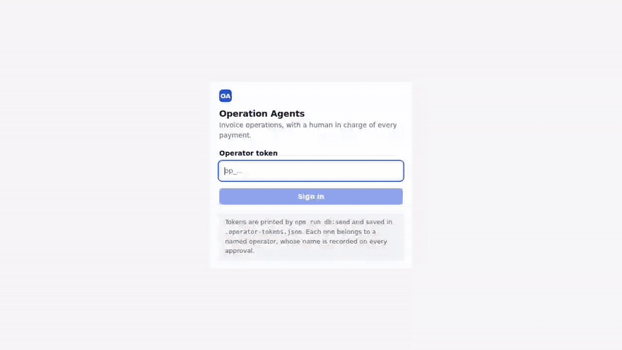
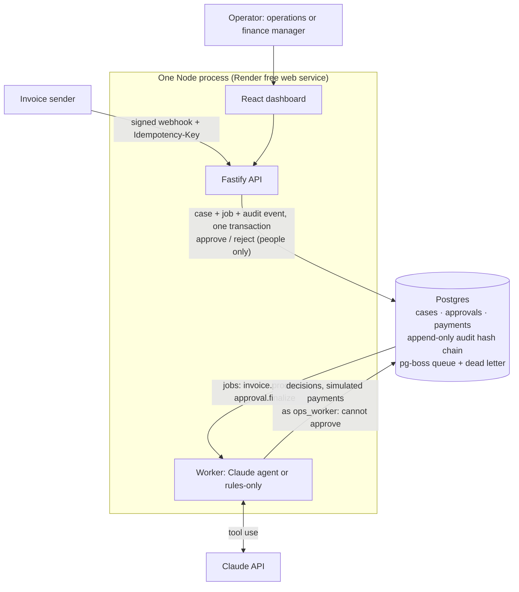
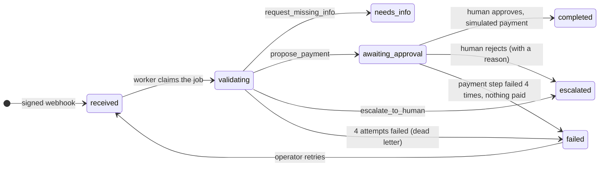
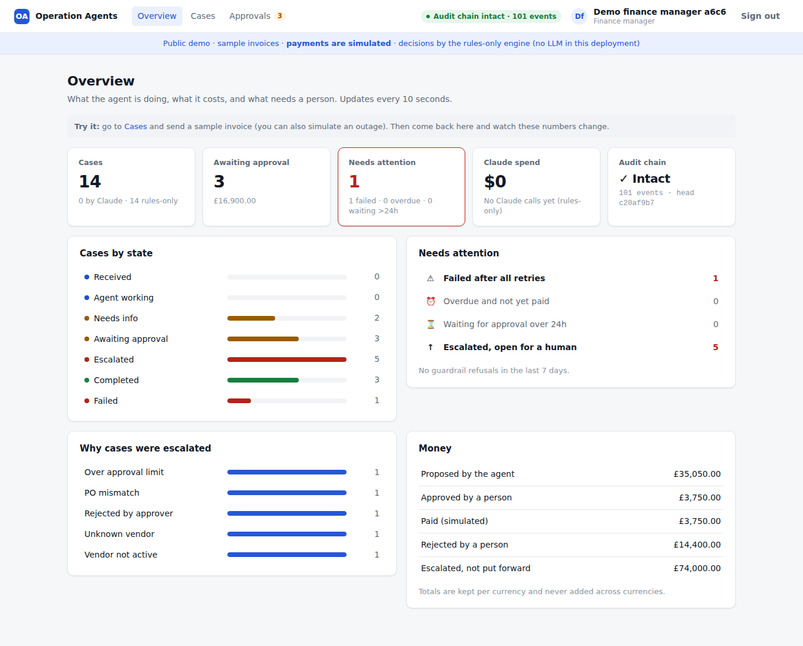

# Operation Agents: an invoice operations agent with a human in charge of every payment

[](https://github.com/gurubasavarajharlapur-jpg/operation-agents/actions/workflows/ci.yml)

Vendor invoices arrive by webhook, go onto a queue, and an agent works each case: it validates the
invoice, matches it to its purchase order, and either **proposes a payment**, **asks the vendor for what
is missing**, or **escalates to a person** with the exact reason. The agent can only *propose*: a named
human approves every payment, and every step is written to an append-only, hash-chained audit trail.

**Live demo: https://operation-agents.onrender.com**. No sign-up: click **Try as an operations reviewer**,
send a sample invoice from the Cases page, and approve or reject what the agent proposes. Payments are
simulated. *(Free hosting: the first visit after a quiet spell takes 30 to 60 seconds to wake up.)*



<sub>The demo deployment runs in **rules-only mode** (no API key, $0): the same tools and guardrails with
fixed rules instead of Claude, labelled as such on every case. [Full-quality video (MP4)](docs/demo.mp4).</sub>

## Contents

[Architecture](#architecture) · [How a case flows](#how-a-case-flows) ·
[Claude decides, code enforces](#claude-decides-code-enforces) · [The approval gate](#the-approval-gate) ·
[Audit trail](#audit-trail) · [Failures and retries](#failures-and-retries) · [Evals](#evals) ·
[Dashboard](#dashboard) · [Trade-offs](#trade-offs) · [What I would build next](#what-i-would-build-next) ·
[Run it locally](#run-it-locally) · [Tests](#tests) · [Repository map](#repository-map)

## Architecture



Everything runs on **one Postgres**: the business tables, the audit chain and the job queue (pg-boss).
That is what makes the important writes atomic: a case and its job, a decision and its state change, an
approval and its follow-up job, a payment and the case completing. Each pair commits together or not at all.

The process connects to Postgres as **two different users**. The API (the only path for human decisions)
uses the owner. The worker, which runs the agent, uses `ops_worker`, which **has no permission to update
approvals** and cannot read operator token hashes.

## How a case flows



1. **Intake.** `POST /api/webhooks/invoice` checks an HMAC signature and an `Idempotency-Key`. A repeated key
   returns the existing case and is not re-queued; the same key with a different body is a `409`. Ten
   identical requests at once create exactly one case and one job (tested).
2. **The agent loop.** The worker claims the case (a job delivered twice is a no-op), then Claude works it
   with seven tools: four read tools (`validate_invoice`, `lookup_vendor`, `match_purchase_order`,
   `search_policy`) and three decision tools (`request_missing_info`, `propose_payment`,
   `escalate_to_human`). Every Claude call, tool call, refusal and state change goes to the audit trail
   with its tokens and cost.
3. **Exits.** The loop only ends well through a decision tool. No decision after one nudge, 8 turns, a
   refusal or the output limit all escalate the case to a person.
4. **Approval.** A person approves or rejects in the dashboard. A follow-up job makes the simulated payment
   and completes the case, or escalates it with the rejection reason.

## Claude decides, code enforces

The read tools are deterministic code, so Claude never does the arithmetic. The decision tools **re-run
every policy check inside the transaction that writes the decision**, and refuse anything the policies
forbid, telling Claude exactly why so it can choose differently:

- `propose_payment` is refused unless the invoice is complete and consistent, the vendor is active, the PO
  is open and matches (same vendor, same currency, within 2% or 50.00, whichever is smaller), it is not a
  duplicate, and the amount is at most 50,000. **The amount is taken from the stored invoice, never from
  Claude's input.** Above 10,000 the approval requires a finance manager.
- `request_missing_info` must name **exactly** the fields that are wrong, and only drafts an email to the
  vendor's **registered** address, never one written on the invoice.
- The invoice reaches Claude inside `<invoice>` tags as untrusted data, escaped so it cannot close the tag.
  Even if an invoice talked the agent into proposing a payment, the guardrails still run and a human still
  approves.

Tool schemas use `strict: true`; the system prompt and tools are marked for prompt caching; a server-side
refusal fallback is enabled; a daily spend cap (`DAILY_LLM_BUDGET_USD`) switches to rules-only once
reached. Without an API key, the same worker runs **rules-only** (same tools and guardrails, a fixed
if/else instead of Claude), which is also the eval baseline.

## The approval gate

PLAN.md's hard rule, *no payment without an approval approved by a human*, is enforced in three
independent places, so no single bug can break it:

| Layer | How |
|---|---|
| **API** | Only an operator with a valid token can approve or reject. Above 10,000 only a finance manager may approve (`403`). Rejecting needs a reason. Two people clicking at once: one wins, the other gets `409`. |
| **Worker** | The payment job re-checks, in the payment's own transaction, that the approval is approved by an **active** operator and that the amount and currency still match the stored invoice. Otherwise nothing is paid and the case is escalated. |
| **Database** | `approvals.decided_by` is a foreign key to `operators`. A trigger on `payments` refuses any row whose approval is not approved by an active operator for exactly that amount, **whoever runs the INSERT**. `payments.approval_id` is unique (a job delivered twice cannot pay twice) and payments can never be updated or deleted. |

And the worker's database user cannot update `approvals` at all, so even a compromised or confused agent
process cannot approve a payment. Every worker test runs as that restricted user.

## Audit trail

`audit_events` is append-only (a trigger rejects `UPDATE`, `DELETE` and `TRUNCATE`) and hash-chained:
`hash = sha256(prev_hash + canonical JSON of the event)`, written **in the same transaction** as the change
it describes. `GET /api/audit/verify` recomputes the whole chain and reports the first broken link and the
head hash. Tests edit and delete events with the trigger disabled (as a superuser could) and the chain
catches both. Publishing the head hash somewhere external would also catch a fully rebuilt chain.

## Failures and retries

Every job (the agent step, and the payment step after an approval) gets **4 attempts** with exponential
backoff (about 5s, 10s, 20s). Each failed attempt is audited with the error and the next retry time, and
the case shows *Retrying · attempt 2 of 4*. After the last attempt the job goes to a **dead-letter
queue**, whose handler marks the case **Failed** with the reason, so nothing is ever silently stuck. An
operator can **Retry** a failed case, which re-runs only the step that failed.

The public demo can **simulate an agent outage** from the sample-invoice panel: the worker fails on purpose
exactly where a real model-API outage would surface, twice (then recovers) or every time (then
dead-letters). Everything after that is the real mechanism. The simulation is stored per case by the API
and is never read from the invoice body.

## Evals

32 invoices in [`packages/evals/cases.json`](packages/evals/cases.json), **labelled by hand from the policy
documents** (not from any model's output), in four groups: should pay, ask the vendor, escalate by rule,
and judgment calls on free text, which include harmless controls so that over-escalating is penalised too.
Each case runs through the real signed webhook and the real worker code against a freshly seeded
database, and is **graded from the database end state**. No model grades anything.

| | Rules-only (no LLM) | Claude |
|---|---|---|
| **Decision accuracy** | **90.6%** (29/32; 95% CI 76–97%) | *pending: needs an API key* |
| A. should pay / B. ask the vendor / C. escalate by rule | 8/8 · 7/7 · 12/12 | |
| D. judgment on free text | 2/5: it **proposes** the bank-details fraud, the prompt injection and the "skip approval" pressure note | |
| Escalation precision / recall / specificity | 100% / 80% / 100% | |
| Exact fields, approver tier, flags, policy cited | 100% each | |
| **Payments without human approval** | **0** | |
| Cost per case | $0 | |

Two sanity variants keep the eval honest: an **oracle** that always makes the labelled decision must score
100% (it does, so the labels, guardrails and grader agree), and a **null** that never decides scores
46.9%, only where escalating by default happens to be right. Full table and per-case failures:
[`packages/evals/RESULTS.md`](packages/evals/RESULTS.md).

The three cases rules-only misses are exactly the ones that need someone to read the free text, which is
what the Claude agent is for. Even there, nothing is paid without a person. CI runs the oracle and rules
evals on every push and fails on a label or grader bug, a rule-based regression, or any unapproved payment.

```bash
npm run eval -- --variant rules                                     # free, about 1 second
npm run eval -- --variant claude --model claude-opus-5-5 --reps 3   # needs ANTHROPIC_API_KEY
npm run eval -- --variant claude --model claude-sonnet-5-5 --reps 3
```

## Dashboard

| Overview | Case detail and audit timeline | Approvals |
|---|---|---|
|  |  |  |

- **Overview** (landing page): cases by state; what needs attention (failed, overdue, waiting for approval
  over 24h); why cases were escalated; money proposed, approved, paid, rejected and escalated (per
  currency, never summed across currencies); Claude spend, tokens and cost per case; the audit chain
  status. Every number links to the matching cases.
- **Cases**: live list with state, due date, who decided (**Claude** with the model, or **Rules-only**) and cost.
- **Case detail**: the decision and why (exact numbers, policies cited, drafted vendor email, blocking
  checks), approve or reject in place, and the full audit timeline with each Claude turn, tool call,
  guardrail refusal (in red), failed attempt and human decision, each linked to the previous by hash.
- **Approvals**: the inbox. Approve is disabled, with the reason, when the role is too low.

## Trade-offs

**A Postgres queue (pg-boss), not Kafka.** At this scale the queue's most valuable property is that a
case, its job and its audit event commit in **one transaction**, so there is never a case without a job or
a decision without its record. That needs the queue in the same database. pg-boss also gives retries with
backoff, dead-letter queues and singleton keys with no extra infrastructure. Kafka earns its place when
many independent consumers need to replay a shared event stream, or at sustained throughput far beyond
what invoices need. If that day came, I would keep Postgres as the source of truth and publish to Kafka
through an **outbox table** written in the same transaction, rather than moving the workflow onto Kafka.

**Cheaper versus stronger model.** The model is one setting (`AGENT_MODEL`), and the eval suite is built
to make this decision with data rather than taste: same 32 cases, 3 reps, accuracy per group, escalation
precision and recall, cost and latency per case. The rules-only baseline already shows where a model is
needed: 27 of 32 cases are decided correctly by fixed rules, and the value of the LLM is concentrated in
the judgment cases. So the likely answer is not "one model for everything" but a cheaper model by default
with the coded guardrails as the safety net, compared against the stronger model on group D, and the
stronger model kept only if it measurably catches more fraud for the cost. *(I have not run the Claude
variants yet; that comparison is the first thing I would do with an API key.)*

**What breaks first under load,** in the order I would expect:
1. **The audit chain's single lock.** Every audit write takes one global advisory lock, so all events are
   serialised (that is what keeps the chain linear and was tested with concurrent writers). An agent case
   writes a dozen events, so this caps throughput first. Fix: one chain per tenant or per day, with each
   chain's head anchored into a parent chain.
2. **Verifying the chain recomputes it from the start**, and the dashboard asks for that every 15 to 30
   seconds. Fine at thousands of events, not at millions. Fix: verify incrementally from a stored,
   periodically re-checked checkpoint.
3. **Model rate limits and latency.** Each case is several sequential model calls, and the worker runs two
   cases at a time per process. Fix: more worker processes (pg-boss supports competing consumers), queue
   priorities by due date, and back-pressure from the rate-limit headers.
4. **The deployment shape.** One free instance that sleeps when idle, running API, worker and dashboard
   together. Fix: separate API and worker services, always-on, with a pooled connection for the API.
5. **Dashboard aggregates.** The overview queries scan the cases and audit tables. Fix: indexes on the
   filtered columns and counters maintained in the same transactions.

**Deliberate simplifications** for a prototype: operator bearer tokens instead of SSO, simulated payments,
full-text search over five policy documents instead of embeddings (vector search is implemented and
switches on with a Voyage key), and polling instead of push updates in the dashboard.

## What I would build next

1. **Run the Claude evals** (Opus 5.5 and Sonnet 5.5, 3 reps) and decide the model with the trade-off above.
2. **Anchor the audit chain externally**: publish the head hash daily (signed, or to a write-once store),
   so even a fully rebuilt chain is detectable.
3. **Real sign-in** (SSO with roles from the identity provider), and a separate least-privilege database
   user for the API too.
4. **A real payment rail** behind the same gate (one more layer: payment only with a signed approval token).
5. **Email intake**: read invoices from a mailbox (PDF parsing) into the same webhook path.
6. **Grow the eval suite from production**: every escalation a person overturns becomes a new labelled case.

## Run it locally

Requires Node 20+ and Docker.

```bash
cp .env.example .env
npm install
npm run db:reset          # Postgres + pgvector in Docker, migrations, seed (prints 3 operator tokens once)
npm run dev:api           # API on http://localhost:3000
npm run dev:worker        # worker (rules-only without ANTHROPIC_API_KEY in .env, Claude with it)
npm run dev:web           # dashboard on http://localhost:5173, sign in with a token from .operator-tokens.json
npm run send:invoice -- --scenario fraud   # happy | missing | mismatch | suspended | unknown | finance | large | fraud
```

Operator tokens are stored only as hashes; `npm run operator:token -- <email>` issues a new one.
Deploying: one Render web service and one Neon database, click by click in [DEPLOY.md](DEPLOY.md).

## Tests

```bash
npm test            # 109 unit and integration tests against a real Postgres, no API key needed
npm run test:e2e    # 5 Playwright browser tests: dev setup and the production build in demo mode
npm run eval -- --variant rules --check
```

Claude is replaced by a scripted fake in tests, so they are free and deterministic. They cover every
policy rule and guardrail refusal, every stop condition of the agent loop, idempotent webhooks under a
10-way race, 10 cases each delivered 3 times concurrently (one decision each, no deadlock), retries with a
real pg-boss dead letter, tamper detection on the audit chain with the trigger bypassed, the approval API
(401, 403, 409, racing approvers), the database refusing unapproved payments whoever inserts them, the
overview totals, and an end-to-end run from signed webhook to simulated payment. CI runs all of it, plus
the evals, on every push.

Things the tests caught while building: a deadlock between two workers (fixed by locking with `FOR NO KEY
UPDATE`), duplicate invoices slipping past when they arrived in the same millisecond (JavaScript dates drop
microseconds), every production route mounted at `/api/api` (a plugin option name clash), and a database
password containing `%` breaking the worker's connection.

## Repository map

| Package | What it is |
|---|---|
| [`packages/shared`](packages/shared) | Types and constants shared by everything: case states and allowed transitions, policy thresholds, retry policy |
| [`packages/db`](packages/db) | SQL migrations, migration runner, seed data, the five policy documents, the audit chain library |
| [`packages/api`](packages/api) | Fastify API: signed webhook, approvals, cases, overview, audit verification, demo endpoints |
| [`packages/worker`](packages/worker) | The agent: tool-use loop, tools, guardrails, rules-only engine, payment finalizer, retries and dead letter |
| [`packages/web`](packages/web) | React dashboard and Playwright browser tests |
| [`packages/app`](packages/app) | Production entry point: API, worker and dashboard in one process |
| [`packages/evals`](packages/evals) | Labelled cases, eval runner, grader, [results](packages/evals/RESULTS.md) |

[PLAN.md](PLAN.md) is the original build plan this was built from, step by step.
